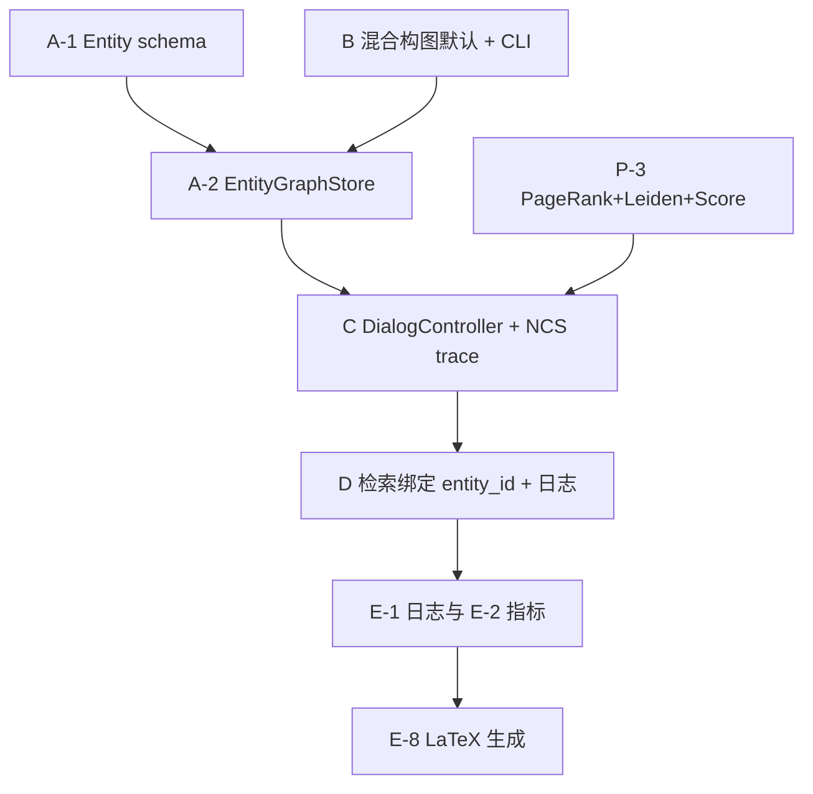

# DualGraph / MOSAIC 全量工程方案（手稿对齐 · 代码现状核对 · 可推翻架构）

> **定位**：本文档是**全量交付规格**，不是「最小可跑」清单。目标是在可复现前提下，使程序能力覆盖 `Manuscript/manuscript.tex` Methods 与 Results 中**可机器验证**的陈述，并支撑 `experiments/README.md` 中 Experiment 1/2 的完整矩阵。  
> **允许推翻现行架构**：下文「目标架构」可与当前以 `ClassGraph` + `networkx.Graph` 为中心的实现**显著不同**；迁移策略单独说明。  
> **构图默认策略**：**禁止**将「纯 TF-IDF/hash、全量 `Unclassified`」作为论文主方法或 example 主路径的默认；主路径必须是 **TF-IDF（或嵌入）路由 + LLM 结构化** 的混合构图，纯 hash **仅**作为显式基线（见 §6）。  
> **模型约定（不变）**：构图 / 控制 / 检索辅助 / 作答 / judge 默认统一 **Qwen3.5-plus**（`get_mosaic_chat_model_spec()`）；证据嵌入可用 **BGE**（与 Qwen 分离）。可比性说明见文首「诚实边界」。

---

## 0. 诚实边界（与手稿一致）

- **临床试点、示意图、叙事占位 `\placeholder{...}`**：不能仅靠 benchmark 自动填满。  
- **LoCoMo 原论文 GPT judge**：本仓库改为 Qwen judge，**不可直接逐数对比**；须在方法与 Limitation 写明。  
- **手稿「四域临床」与实验 README「四条件基准」**：若最终实验以 LoCoMo/HaluMem 为主，正文需人工对齐叙事。

---

## 1. 手稿 Methods ↔ 代码现状：逐项对照（2025–03 仓库快照）

下表按 `Manuscript/manuscript.tex` §Methods（约 L1488 起）**逐项**映射到 **当前 `mosaic/` 行为** 与 **缺口**。「实现落点」指建议模块/文件层级（允许新建，不限于现有路径）。

| 手稿要素 | 数学/文字定义（摘要） | 当前代码中是否存在等价实现 | 缺口说明 | 建议实现落点（全量方案） |
|----------|----------------------|---------------------------|----------|-------------------------|
| 节点集 \(V\) | 原子信息单元；含信念、熵、元数据 | `ClassNode` + `_instances` 字典列表；**非**单一实体类型 | 类/实例二级结构与手稿「实体节点」不对齐；难以直接算 \(H(v)\)、PageRank on \(V\) | 引入 **`EntityNode`（或图上的唯一 `entity_id`）** 作为 \(V\) 元素；`ClassNode` 可退化为聚类视图或废弃 |
| \(G_P\) 有向无环 | 硬先决；DAG | `graph_edge_*.json` 有 `edge_leg=P`，但多为**共现团**；**无 DAG 校验** | 方向、无环、与「先决」语义未 enforce | `src/graph/dual/dag_gp.py`：`networkx.DiGraph` + `is_directed_acyclic_graph`；构图 LLM 输出 `(u,v)` + **环破拆（Tarjan/SCC）**（手稿 L1661-1662） |
| \(G_A\) 无向加权 | \(w_A\) ∝ 描述嵌入余弦相似度 | `edge_leg=A` 预留；**无系统写入**；共现不赋 \(w_A\) | 无 \(G_A\) 权重、无 Leiden 输入图 | `src/graph/dual/ga_weighted.py`：BGE 实体描述向量 + 阈值/Top-K 建边；写 `weight` 字段 |
| NCS 更新前沿 \(\mathcal{U}_t\) | \(\Delta_t\) 信念变化 → 仅邻居重算分数 | **无** turn 级控制循环；无 `dirty` 标志 | 当前是「离线构图 + QA 检索」，**不是**手稿对话控制每轮 | 新增 **`DialogController`**（或实验用「伪回合」仿真）：每步写入 `delta_entities`、`predicted_frontier`、`actual_rescore_set` |
| 分数 \(\mathrm{Score}(v)\)（手稿式 (4) 附近） | \(\alpha \tilde I+\beta T+\gamma C\) | **无** 归一化重要性 + PageRank + 社区连续项 | 无 \(\tilde I, T, C\) 合成 | `src/control/scoring.py`：`importance_entropy`、`pagerank_nx(G_A)`、`community_id(v)==community_id(v_prev)` |
| Leiden 社区 | 在 \(G_A\) 上 | **无** | — | `igraph`/`leidenalg` 或 `networkx`+替代；配置 `resolution`（手稿占位） |
| 置信门控 \(\rho_{\min}\) | 低于阈值不提交 LTM | 实例字段有部分置信/描述，**无统一门控状态机** | — | `src/memory/gating.py`：与 `EntityNode.belief` 绑定 |
| 信念更新（式 Bayes） | \(b_{v,k}^{(t+1)}\) | **无** 显式 K-状态分布 | — | 可先 **简化为 {unknown, partial, confirmed}** 三态 + LLM likelihood，再扩展 |
| LTM 检索 top-m | BGE + HNSW（手稿占位） | 检索为 TF-IDF + 可选邻居扩展（P-2）；**非**实体级向量库 | — | `src/retrieval/vector_store.py`（可选 Phase 2） |
| 半自动构图四步 | 实体抽取 → \(E_P\) → \(E_A\) → 专家审 | 当前 LoCoMo 流：**批消息** → `sense_classes`（TF-IDF+LLM）→ 实例 LLM/hash | **与手稿「任务说明文档→图」不同**；LoCoMo 是**对话驱动在线增长** | **两条子管线都要规格化**：(A) **规范任务图离线构建**（供临床域）；(B) **对话在线演化**（供 LoCoMo），并在论文中区分表述 |
| NCS 实验 | 局部 vs 全局重算、震荡、耗时 | **无** 双模式日志 | — | `src/telemetry/ncs_trace.py` + ingest JSONL |
| Per-turn latency 表 | 分项毫秒 | **无** 构图级分项（仅有 QA 墙钟） | — | 在 controller 内 `time.perf_counter` 分栏记录 |

**结论（工程）**：当前 `mosaic` 是 **「对话批处理构图 + 静态图 QA」** 原型；手稿核心 **「每轮 NCS + 双图评分选下一问 + 演化 DAG」** 尚不在主路径。全量方案必须要么 **补齐控制循环与遥测**，要么 **修改手稿实验表述为「离线图 + QA」**——本方案按 **补齐** 为默认，并在 §12 说明若资源不足时的降级发表边界。

---

## 2. 仓库现状清点（文件级，便于对照修改）

### 2.1 入口与编排

| 路径 | 职责 | 与手稿关系 |
|------|------|------------|
| `mosaic/cli.py` | `build`：`args.hash` 为真 → `save_hash`；否则 `save` + 可选 pickle 图、`generate_tags_tfidf` | **默认无 `--hash` 已是 LLM 构图**；但 example 脚本常传 `--hash`，导致与论文脱节 |
| `mosaic/src/save.py` | `save` → `_process_data_truncation`（LLM 实例）；`save_hash` → `_process_data_truncation_hash` | hash 路径**硬编码** `use_llm_for_new=False`、`use_hash=True` |
| `example/Locomo/run_conv0_timed/run.py` | 调 mosaic build | 需改为默认 **hybrid/LLM**，hash 显式 |
| `mosaic/src/query.py` | 加载 pkl → `run_qa_loop`：检索 + 作答 LLM + judge | **无** `retrieved_context` 结构化日志（E-1） |
| `mosaic/src/qa_common.py` | `judge_answer_llm` | 符合统一 Qwen |

### 2.2 数据与算法核心

| 路径 | 职责 | 缺口 |
|------|------|------|
| `mosaic/src/data/graph.py` | `ClassGraph`：`sense_classes`、TF-IDF、检索、邻居扩展（P-2）、快照、`self.edges` | 无实体级 \(V\)；`networkx` 图**常无边**；与 `self.edges` 双轨 |
| `mosaic/src/data/classnode.py` | 类下实例更新（LLM / hash 分支） | 非 DAG 实体 |
| `mosaic/src/data/dual_graph.py` | `edge_leg` P/A 常量与计数 | 无构图算法写 A 边 |
| `mosaic/src/data/instance.py` | 实例结构辅助 | — |
| `mosaic/src/data/classedge.py` | 空文件 | 可改为显式边类型定义或删除 |
| `mosaic/src/assist.py` | TF-IDF、序列化、`fetch_default_llm_model` 单例 | BGE 与 TF-IDF 并存需规范 |
| `mosaic/src/config_loader.py` | API、LLM、embedding 路径、`[QUERY] neighbor_*` | 缺 `[BUILD]`、`[CONTROL]`、`[NCS]` |
| `mosaic/src/llm/llm.py` | Qwen + OpenAI client 缓存 | 可加统一 retry/限速 |

### 2.3 未实现或仅在实验 README 中的能力

- HaluMem / LongMemEval **适配器**、Mem0/Letta/… **基线**：不在 `mosaic/` 内。  
- `Manuscript/generated/tab_*.tex` **生成脚本**：不在本仓库核心路径（需 `experiments/` 落地）。

---

## 3. 目标架构（全量，可偏离现状）

建议将代码划分为 **六层**，层间只通过 **DTO/JSON schema** 通信，便于替换 `ClassGraph` 内部实现而不改实验编排。

```
┌─────────────────────────────────────────────────────────────┐
│  experiments/ 编排：方法×条件×种子 → 调用 Runner            │
└───────────────────────────┬─────────────────────────────────┘
                             ▼
┌─────────────────────────────────────────────────────────────┐
│  Runner：ingest | simulate_dialog | qa_eval | export_artifacts│
└───────────────────────────┬─────────────────────────────────┘
         ┌──────────────────┼──────────────────┐
         ▼                  ▼                  ▼
   IngestionPipeline   DialogController   RetrievalService
         │                  │                  │
         ▼                  ▼                  ▼
   EntityGraphStore     NCS / Scoring      VectorIndex + TF-IDF
         │                  │                  │
         └──────────────────┴──────────────────┘
                             ▼
                      Telemetry / JSONL / snapshots
```

### 3.1 核心数据结构（必须在 schema 中写死字段名）

**`EntityGraph`（内存 + JSON 导出）**

- `entities: dict[entity_id, EntityRecord]`  
  - `entity_id: str`（稳定 UUID 或 `conv:turn:name` 规则）  
  - `canonical_name: str`（LLM 命名，禁止长期停留在 `Unclassified` 作为唯一桶）  
  - `description: str`（用于 BGE）  
  - `belief: object`（至少支持离散状态 + 熵 \(H(v)\) 的浮点缓存）  
  - `metadata: object`（来源 turn、会话 id、原始 message_labels）  
- `edges_p: list[{source, target, leg:"P", confidence?, provenance}]`  
- `edges_a: list[{u, v, leg:"A", weight, provenance}]`  
- `communities: dict[entity_id, comm_id]`（Leiden 输出）  
- `version, build_mode, conversation_id`

**`TurnTrace`（NCS / Part A）**

- `turn_index, delta_entities, predicted_frontier, actual_rescore_entities`  
- `timing_ms: {score_update, memory_retrieval, entity_extraction, llm_inference, total}`（对手稿 latency 表）  
- `mode: "ncs" | "global_recompute"`

**`QARecord`（E-1）**

- `question_id, category, method, condition, build_mode`  
- `retrieved_context: {tfidf_hits, neighbor_entities, prompt_chars}`  
- `graph_stats: {|V|, |E_P|, |E_A|, density, ...}`

### 3.2 与旧 `ClassGraph` 的关系（迁移）

- **短期**：`ClassGraph` 作为 **IngestionPipeline 的适配器后端**，每批结束后 **导出** `EntityGraph` JSON（P-8）。  
- **中期**：新对话控制只读 `EntityGraphStore`，`ClassGraph` 仅用于遗留 LoCoMo 构图兼容。  
- **长期**：删除 `ClassGraph` 中重复逻辑，仅保留 LoCoMo 消息解析工具函数。

---

## 4. 轨 A：数据模型、序列化与 NetworkX 同步

### A-1 目标

- 单一真源：**`EntityGraph` JSON**（及可选 sqlite）；pkl 可为派生物或废弃。  
- **`networkx` 必须与 \(G_P\)、\(G_A\) 同步**：查询与分析不再依赖「仅有 `functions` 隐式边」。

### A-2 具体工作项

1. **定义 JSON Schema**（`mosaic/schemas/entity_graph.schema.json`）：上述字段 + `edge_leg` 枚举。  
2. **实现 `EntityGraphStore`**：`add_entity`、`add_edge_p`、`add_edge_a`、`validate_dag()`、`export()`。  
3. **在 `update_class_relationships` 或替代管道中**：每产生一条共现边，**同时** (a) 写 `edges_p` 或 `edges_a`（按策略）；(b) `G_p.add_edge` / `G_a.add_edge`。  
4. **快照**：`graph_snapshot_*.json` 改为从 `EntityGraph` 生成，或双写一段过渡期字段 `legacy_class_snapshot`。  

### A-3 验收

- [ ] 随机抽样 1 个 conv：`|E|`（JSON）与 `nx` 边数一致。  
- [ ] `is_directed_acyclic_graph(G_p)` 在 **Evolving** 模式下每 turn 为 True（或记录破环边）。

---

## 5. 轨 B：构图管线（混合 LLM + 检索，禁止纯 hash 默认）

### B-1 原则

- **主路径 `BUILD_MODE=hybrid`**：`sense_classes` 中 **必须** `use_llm_for_new=True`；实例更新 **必须** `use_hash=False`。  
- **`BUILD_MODE=hash_only`**：仅用于基线；**必须在日志与论文表中标注**，不得作为 example 默认。  
- **配置**：`[BUILD] mode = hybrid|hash_only` + `MOSAIC_BUILD_MODE` 覆盖；`cli --hash` 强制 `hash_only`。

### B-2 与手稿「半自动构图四步」的对齐方式

| 手稿步骤 | LoCoMo（对话）实现策略 | 临床/表格任务（未来）实现策略 |
|----------|------------------------|------------------------------|
| 实体抽取 | 每批消息 LLM 输出 **候选实体 + 合并到已有 entity_id**；TF-IDF 仅作 **路由** 到已有类/实体 | 从 PDF/表单 OCR+LLM 抽实体表 |
| \(E_P\) | LLM 对 **(u,v) 是否先决** 分类；阈值+投票；DAG 校验 | 同左 |
| \(E_A\) | BGE(description_u, description_v) ≥ θ 或 LLM Likert | 同左 |
| 专家审 | Part D：人工改 JSON diff（E-7） | 工作流外 |

### B-3 具体代码触点（现行仓库）

1. `cli.py` `cmd_build`：根据 `get_mosaic_build_mode()` 决定 `save` vs `save_hash`；**默认不得**因 example 传参而变 hash。  
2. `save.py`：抽出 `run_batch(memory, batch, mode)`，`mode` 枚举贯穿 `sense_classes` / `process_relevant_class_instances` / `add_classnodes`。  
3. `graph.py` `sense_classes`：  
   - 记录 `matched_labels_count`、`unmatched_count`、`llm_json_fail_count`；  
   - JSON 失败时 **仍** 可回退 `Unclassified`，但 **计数写入 telemetry**，论文中报告失败率。  
4. **新 prompt 文件**（若需）：`prompts_entity_graph_en.py`：严格 JSON schema（`new_entities[]`, `new_edges_p[]`, `new_edges_a[]`），与 `parse_llm_json_object` 一致。

### B-4 验收

- [ ] 同一 conv，`hybrid` 下 **≥3 个 distinct `canonical_name`**（或达到你方事后标定的 N）。  
- [ ] `hash_only` 下 **零次** 构图 LLM 调用（用计数器或 mock 断言）。

---

## 6. 轨 C：对话控制、NCS、打分与三模式（P-4～P-6 展开）

### C-1 `DialogController` 状态机（全量）

每「回合」（LoCoMo 可用 **用户消息边界** 或 **固定步** 仿真）：

1. **提取**：LLM/规则从用户话轮更新 \(\Delta_t\)（涉及实体集合）。  
2. **NCS**：计算 `predicted_frontier = neighbors(Δ_t) ∪ Δ_t`（在 \(G_P \cup G_A\) 上邻域定义需在代码注释中与手稿公式对齐）。  
3. **重算**：仅对 `dirty` 实体更新 \(H(v)\)、\(\tilde I(v)\)；合成 `Score(v)`。  
4. **选择**：`argmax_{v in frontier satisfying G_P} Score(v)`（先决检查：拓扑序可达未解节点）。  
5. **生成问句**（若做主动对话实验）：LLM 仅负责自然语言，**禁止**绕过图选点。  
6. **遥测**：写 `TurnTrace` JSONL。

**Global recompute 对照模式**：同一输入，强制对所有 \(v\in V\) 重算分数，用于 Part A 表。

### C-2 `Memory-Only` / `Static` / `Evolving`（手稿）

| 模式 | 行为规格 |
|------|----------|
| Memory-Only | 无 \(G_P,G_A\) 控制；仅向量检索历史；`TurnTrace` 中 `graph_stats` 全零或标记 N/A。 |
| Static | \(G_P,G_A\) 在 ingest 结束时冻结；对话中 **不** `add_node`。 |
| Evolving | 允许新实体附着；**每次 attach** 运行环检测 + NCS 前沿记录（手稿 Fig.4）。 |

### C-3 验收

- [ ] Part A：`predicted_frontier == actual_rescore` 匹配率 ≥ 目标（手稿写 99%，以日志为准）。  
- [ ] latency：NCS vs global 分项毫秒可聚合为 Methods 表。

---

## 7. 轨 D：检索、QA 与 P-2/P-3 扩展

### D-1 当前已有

- TF-IDF 类/实例检索；`method=llm` 时 LLM 选类；P-2 邻居扩展（`functions` + `edges`）。  

### D-2 全量增强

1. **检索对象**：从「实例 dict」升级为 **`entity_id` 列表** + 拼接 `description` + `evidence_snippet`。  
2. **BGE**：对 query 与实体描述算相似度，**融合** TF-IDF 分数（可调 \(\lambda\)）。  
3. **日志**：每题输出 `retrieved_entity_ids`（有序）、`neighbor_expansion_ids`。  

### D-3 验收

- [ ] `qa_*_eval_full.json` 含 E-1 字段；可重放生成 Figure 7 案例图数据。

---

## 8. 轨 E：实验编排与产物（E-0～E-10 全量展开）

### E-0 实验契约（配置文件）

- **单一 YAML**：`method ∈ {mosaic_evolving, mosaic_static, memory_only, …}` × `condition ∈ {full, ablate_gp, …}` × `seed` × `build_mode` × `retrieval_method`。  
- **冻结**：LoCoMo category 5 是否评测；写死在 YAML 与 `qa_common.skip_category`。

### E-1 每题日志 schema

- 字段名与类型固定；**向后兼容**：旧 JSON 缺字段时填充 `null` 并 `schema_version`。

### E-2 指标

- Token F1、evidence P/R（BGE≥0.85）、LongMemEval 官方脚本对接；**全部**从日志重算，禁止手写表。

### E-3 ingest JSONL

- 每会话一行：`wall_s`、`max_rss_mb`、`|V|`、`|E_P|`、`|E_A|`、`llm_calls`、`json_failures`。

### E-4～E-10

- 按 `experiments/README.md` Complete Output Inventory **逐文件**列出期望路径；扰动种子 42；Part D 三种图加载器；E-8 bootstrap 与 `generated/*.tex` **单一数据源**。

---

## 9. 轨 F：基线与外部方法

- 每个基线实现 **`BaselineRunner` 接口**：`ingest(dialogue) → store`、`answer(question) → text`。  
- Mosaic 与基线 **共用** 同一 `QARecord` 与 judge 提示词模板。

---

## 10. 合并里程碑（建议顺序与依赖）



**说明**：PageRank/Leiden（P-3）可与 NCS **并行开发**，但 **合成 Score** 必须在 controller 内完成。

---

## 11. 手稿表格/图 → 工程交付映射（速查）

| 手稿/实验产物 | 工程依赖 |
|----------------|----------|
| `tab_graph_structure` | `EntityGraph` 统计 + ingest JSONL |
| `tab_ncs_validation` | `TurnTrace` 双模式 |
| `tab_ablation` | `BUILD_MODE` + profile 开关（P-7） |
| `tab_graph_construction` | Part D JSON + 边对齐脚本（E-7） |
| `tab_locomo` | E-2 全指标 |
| Figure 4/5 | `TurnTrace` + 快照时间序列 |
| Methods latency 表 | `TurnTrace.timing_ms` |

---

## 12. 风险与降级策略（若全量不可按期完成）

1. **仅交付离线图 + QA**：则必须 **修改手稿** 将「每轮 NCS」改为「离线构建 DualGraph + 静态检索」，并删除对 Part A 匹配率 99% 的声称。  
2. **无 HNSW**：LTM 先用暴力余弦 + 小 m，手稿 Limitation 写明。  
3. **无 Leiden**：用连通分量或 Louvain 替代，Methods 更新算法名。

---

## 13. 维护说明（执行状态，与 §1 对照）

| 标签 | 含义 | 当前状态（简） |
|------|------|----------------|
| P-0 | 统一 Qwen | ✅ `get_mosaic_chat_model_spec` / judge |
| P-1 | `edge_leg` P/A | ✅ JSON 与 `dual_graph.py` |
| P-2 | 查询邻居扩展 | ✅ `[QUERY] neighbor_*` |
| P-3～P-8 | 打分/社区/NCS/三模式/消融/JSON | ❌ 以本文 §3–§7 为规格 |
| B 轨 | 混合构图默认 | ⚠️ 代码具备 `save()`，**脚本默认常错误使用 hash**——按 §5 修正 |
| EntityGraph | 手稿级 \(V,G_P,G_A\) | ❌ 待 A 轨 |

---

## 14. 自检清单（交付前）

- [ ] 默认 example / 主实验构图 **非** `hash_only`。  
- [ ] `EntityGraph` JSON 与手稿 \(V,E_P,E_A\) 可一一解释。  
- [ ] NCS 双模式可复现 Part A 图表。  
- [ ] 9 张 `generated/tab_*.tex` 均由脚本从日志生成。  
- [ ] 术语：手稿 DualGraph = 本仓库 MOSAIC = 目录 `mosaic/`（建议在 `experiments/README.md` 保留一行）。

---

*本方案取代原「仅列 P/E 编号 + 简短验收」的写法；实现时以 §1 对照表与 §3 架构为权威。若代码与本文冲突，优先更新代码或显式修订本文档版本记录（建议在文首增加 `Revision: YYYY-MM-DD`）。*
